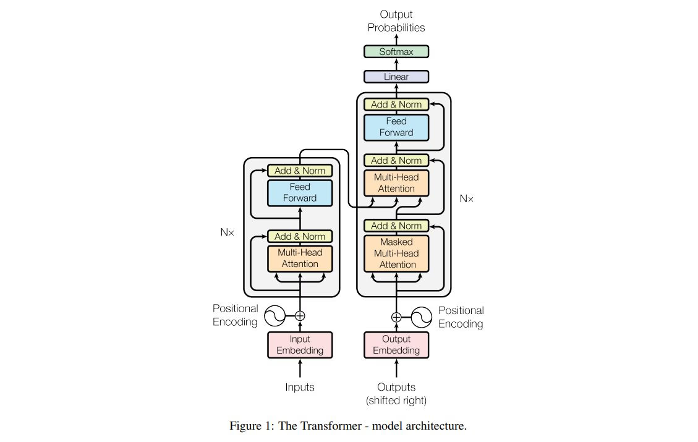
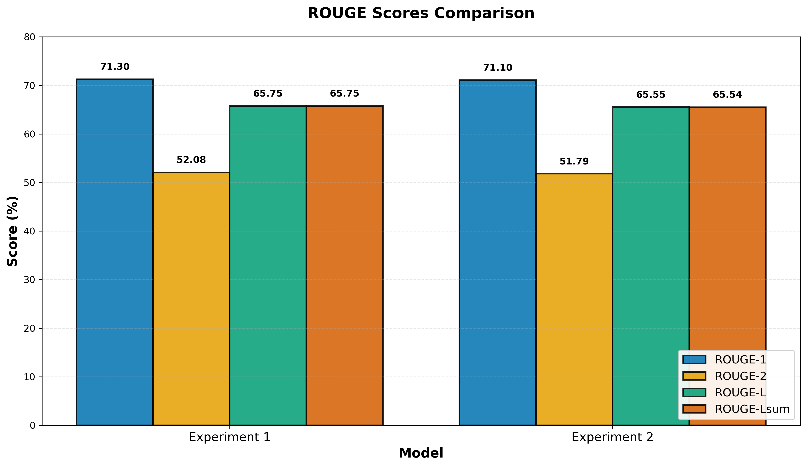
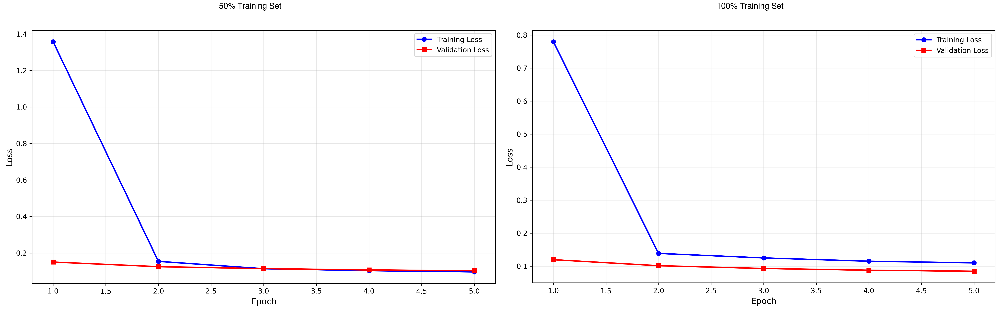

# BioLaySumm – Medical Report Simplification with FLAN-T5

This project fine-tunes **FLAN-T5-base** to translate expert radiology reports into **layperson-friendly summaries**.  
The goal is to make medical information more accessible to patients by simplifying complex radiological terminology while preserving key clinical meaning.

The model is trained using the **BioLaySumm dataset**, with radiology reports as input and corresponding lay summaries as output.
We evaluate performance based on ROUGE, and human readability assessments.

## Table of Contents
- [Model Detail](#model-detail)
- [How the Algorithm Works](#how-the-algorithm-works)
- [Data Pre-processing](#data-pre-processing)
- [Training, Validation, and Test Splits](#training-validation-and-test-splits)
- [Dependencies and Reproducibility](#dependencies-and-reproducibility)
  - [Environment](#environment)
  - [Hardware](#hardware)
  - [Installation](#installation)
  - [Running Training and Inference](#running-training-and-inference)
  - [Running the entire workflow](#running-the-entire-workflow)
  - [Reproducibility](#reproducibility)
- [Training Configuration](#training-configuration)
- [Hardware & Performance](#hardware--performance)
  - [GPU Requirements](#gpu-requirements)
  - [Training Time Per Experiment](#training-time-per-experiment)
- [Evaluation Metrics](#evaluation-metrics)
  - [ROUGE Scores](#rouge-scores)
  - [Training Results](#training-results)
  - [Experiment Summary](#experiment-summary)
- [Repetition Control](#repetition-control)
  - [Example: Before vs After Repetition Control](#example-before-vs-after-repetition-control)
  - [Inference-Time Solution](#inference-time-solution)
- [References](#references)
- [License](#license)
- [Acknowledgments](#acknowledgments)
-

## Model Detail

**T5 (Text-to-Text Transfer Transformer)** is an encoder-decoder transformer that treats all NLP tasks as text-to-text problems.

**FLAN-T5 (Finetuned Language Net)** is an instruction-tuned variant of T5, trained on 1,800+ tasks, making it effective at following natural language instructions.



Figure 1: Transformer Architecture

## How the Algorithm Works

The BioLaySumm model fine-tunes **FLAN-T5-base**, a pretrained text-to-text transformer, on a dataset of radiology report–summary pairs.
Each input contains an expert radiology report describing imaging findings, and the target output is a simplified summary written in lay language.

During training, the model learns to map complex medical terms and sentence structures to clearer, patient-friendly phrasing.
We use **LoRA (Low-Rank Adaptation)** with rank 16 to efficiently fine-tune the model, training only 0.71% of parameters (1.77M out of 249M).
Training employs **teacher forcing** with a standard **cross-entropy loss** to optimise token-level predictions.
Fine-tuning is performed using the **Hugging Face Transformers** and **PEFT** frameworks with **AdamW** optimisation and **gradient clipping** (max_norm=1.0).

**Prompt engineering** is critical to our approach. We use an enhanced prompt that explicitly instructs the model to simplify medical terminology:
*"Simplify this medical report for a patient. Replace technical terms with everyday words and explain what they mean."*

At inference time, the model generates summaries through **beam search decoding** (num_beams=4), balancing fluency and factual accuracy.
Performance is evaluated using **ROUGE-1, ROUGE-2, ROUGE-L, and ROUGE-Lsum scores**, as well as qualitative readability analysis.

## Data Pre-processing

This implementation uses minimal text pre-processing, which is standard practice for instruction-tuned transformer models like FLAN-T5:

1. **Prompt Engineering**: Each input radiology report is prepended with an instruction prompt: *"Simplify this medical report for a patient. Replace technical terms with everyday words and explain what they mean."*

2. **Tokenization**: The FLAN-T5 tokenizer converts text to subword tokens while preserving medical terminology and punctuation.

3. **Sequence Processing**:
   - Maximum length: 512 tokens
   - Truncation: Applied to longer sequences
   - Padding: Applied to shorter sequences for batch processing

**Justification for Minimal Pre-processing:**
- Medical terminology is case-sensitivity (e.g., "COPD" vs "copd")
- The BioLaySumm dataset is already curated and clean
- Preserving original formatting maintains clinical accuracy

## Training, Validation, and Test Splits

This project uses the official BioLaySumm 2025 dataset splits provided by the shared task organizers:

| Split      | Samples  | Percentage |
|------------|----------|------------|
| Training   | 150,454  | 88.0%      |
| Validation | 10,000   | 5.8%       |
| Test       | 10,537   | 6.2%       |

**Note:** Since the test set does not provide reference summaries (ground truth), the validation set is used as the test set for all reported ROUGE scores and evaluations.

**Justification:**

1. **Pre-defined Splits**: We use the official dataset splits from BioLaySumm 2025 to ensure comparability with other participants in the shared task and maintain consistency with published benchmarks.

2. **Large Training Set (88%)**: The 150k training samples provide sufficient data for fine-tuning FLAN-T5-base with LoRA, enabling the model to learn diverse medical terminology and simplification patterns.

3. **Validation as Test Set (5.8%)**: Since the official test set lacks reference summaries, we use the validation set (10,000 samples) for final evaluation. This provides statistically reliable ROUGE scores. The validation set was monitored during training but not used for early stopping or hyperparameter selection.

4. **Test Set (6.2%)**: The official test set of 10,537 samples is reserved for submission to the BioLaySumm 2025 shared task organizers for official evaluation.

5. **No Data Leakage**: Using the official splits prevents information leakage and ensures fair comparison with other systems in the shared task.

## Dependencies and Reproducibility

### Environment
- Python 3.11
- PyTorch 2.4.0
- transformers 4.44.0
- datasets 2.21.0
- peft 0.11.1
- accelerate 0.34.2
- evaluate 0.4.2
- rouge-score 0.1.2
- matplotlib 3.9.0

### Hardware
- NVIDIA GPU with CUDA support (A100 40GB PCIe)
- CUDA 11.8

### Installation

To install the required packages:

```bash
pip install torch transformers peft evaluate matplotlib hf_transfer rouge_score 
```

For GPU support with CUDA:
```bash
pip install torch torchvision torchaudio --index-url https://download.pytorch.org/whl/cu118
```

### Running Training and Inference

```bash
# Train the model
python train.py

# Run inference
python predict.py
```

### Running the entire workflow
To run both training and prediction in one step, use the test driver script:
```bash
python main.py
```

### Reproducibility

**Performance vs. Reproducibility Trade-off:**

This implementation prioritizes **training speed** over exact reproducibility:
- `torch.backends.cudnn.benchmark = True` enables faster training but introduces non-determinism
- No random seeds are set, allowing PyTorch to use optimized but non-deterministic operations
- Dataset is loaded from HuggingFace without version pinning

**Implications:**
- Results may vary slightly between training runs (~1-2% difference in ROUGE scores)
- General trends, conclusions, and model quality remain consistent
- The reported results are real and reproducible within these variance bounds

**For Strict Reproducibility:**
If exact result reproduction is required, add the following to the beginning of `train.py`:
```python
import random
import numpy as np

# Set seeds
random.seed(3710)
np.random.seed(3710)
torch.manual_seed(3710)
torch.cuda.manual_seed_all(3710)

# Enable deterministic operations (slower)
torch.backends.cudnn.deterministic = True
torch.backends.cudnn.benchmark = False
```
Note: This will increase training time by approximately 10-15%.

## Training Configuration
The model was fine-tuned under the following settings:
- **Batch Size:** 16
- **Learning Rate:** 5e-5
- **Epochs:** 5
- **Max Length:** 512 tokens
- **Training Samples Range:** 15,000 - 150,454 (10% to 100% of dataset)
- **Final Training:** 150,454 samples (100% of full dataset)

## Hardware & Performance

### GPU Requirements
- **GPU:** NVIDIA A100 PCIe 40GB
- **VRAM Usage:** ~8-12GB (consistent across all experiments)
- **Batch Size:** 16
- **Precision:** FP32 (full precision)
- **Optimizations:** torch.compile(), gradient clipping, DataLoader workers

### Training Time Per Experiment
- **Experiment 1 (50% training set):** 1h 32m (~16 min/epoch)
- **Experiment 2 (100% training set):** 4h 56m (~59 min/epoch)

## Evaluation Metrics

### ROUGE Scores
ROUGE (Recall-Oriented Understudy for Gisting Evaluation) measures overlap between generated and reference summaries:

- **ROUGE-1:** Unigram (single word) overlap
- **ROUGE-2:** Bigram (word pair) overlap
- **ROUGE-L:** Longest common subsequence
- **ROUGE-Lsum:** LCS at summary level (multi-sentence)

### Training Results

### Experiment Summary

**Table 1**
Note: The ROUGE Scores in the table is the average

| Setting / Metric                  | Exp 1: 50% training set | Exp 2: 100% final model |
|-----------------------------------|-------------------------|-------------------------|
| Training samples                  | 75,227                  | 150,454                 |
| Training time                     | 1h 32m                  | 4h 40m 56s              |
| Final train loss                  | 0.0965                  | 0.1095                  |
| Final validation loss             | 0.1026                  | 0.0848                  |
| Test loss                         | 0.4030                  | 0.0555/13.5135          |
| ROUGE-1                           | 0.7130                  | 0.7110                  |
| ROUGE-2                           | 0.5208                  | 0.5179                  |
| ROUGE-L                           | 0.6575                  | 0.6555                  |
| ROUGE-Lsum                        | 0.6575                  | 0.6554                  |


Figure 2: ROUGE Scores Comparison Bar Chart



Figure 3: Training losses 

#### Example 1

**Input (Radiology report excerpt):**  
The chest shows significant air trapping. Bilateral apical chronic changes are present. Dorsal kyphosis is noted. No evidence of pneumothorax.

**Reference:**  
The chest shows a large amount of trapped air. There are long-term changes at the top of both lungs. The upper back is curved outward. There is no sign of air in the space around the lungs.

**Experiment 1 (50% training set):**  
The chest x-ray shows significant air trapping. There are long-term changes at the top of both lungs. The upper back is curved. There is no sign of air in the lungs.

**Experiment 2 (100% training set):**
The chest shows significant air trapping. There are long-term changes at the top of both lungs. There is a curvature of the spine in the upper back. No signs of air leakage in the chest.

**Analysis:**
- Both experiments correctly identify trapped air and absence of pneumothorax.
- Experiment 2 uses more patient-facing terminology: "air leakage in the chest" vs "air in the lungs."
- For dorsal kyphosis:
  - Experiment 1 uses simpler language: "The upper back is curved."
  - Experiment 2 provides more detail: "a curvature of the spine in the upper back."
- Experiment 2's description is more medically precise while still being accessible.

---

#### Example 2

**Input (Radiology report):**  
Blunting of the left costophrenic angle. Radiographic signs of COPD.

**Reference:**  
The left side of the chest shows a blunting of the angle between the chest wall and the diaphragm. This is a radiographic sign of chronic obstructive pulmonary disease (COPD).

**Experiment 1 (50% training set):**  
The left side of the chest shows a blunting of the angle where the chest wall meets the diaphragm. There are also signs of chronic obstructive pulmonary disease (COPD).

**Experiment 2 (100% training set):**  
The left side where the ribcage meets the diaphragm is less sharp. There are signs of chronic obstructive pulmonary disease (COPD), is a long term lung condition.

**Analysis:**
- Both experiments correctly explain "costophrenic angle" in plain language ("where the chest wall meets the diaphragm" / "where the ribcage meets the diaphragm") instead of using the technical term.
- Both experiments expand "COPD" to "chronic obstructive pulmonary disease," which matches the goal of patient-facing communication.
- Experiment 2 sounds more conversational with "is less sharp" instead of "blunting of the angle."
- Experiment 2 adds helpful context: "is a long term lung condition" - providing extra explanation that makes COPD more understandable for patients.

---

#### Example 3

**Input (Radiology report excerpt):**  
The pulmonary parenchyma and cardiomediastinal silhouette are within normal limits. Dorsal kyphosis is present.

**Reference:**  
The lungs and the area around the heart look normal. There is a condition called dorsal kyphosis, which is a humpback or rounding of the upper back.

**Experiment 1 (50% training set):**  
The lungs and the area around the heart appear to be normal. There is a humpback posture.

**Experiment 2 (100% training set):**  
The lungs and the area around the heart look normal. There is a curvature of the spine in the upper back.

**Analysis:**  
- Both models correctly translate technical terms:  
  - "pulmonary parenchyma" → "the lungs"  
  - "cardiomediastinal silhouette" → "the area around the heart"  
- Both models recognize "dorsal kyphosis" and try to describe it in plain language.  
  - Experiment 1 says "a humpback posture" (more direct for a patient).
  - Experiment 2 says "a curvature of the upper back" (softer tone but less explicit).  
- Neither model fully explains what kyphosis means (that the upper back bends outward). This is a remaining limitation for true layperson clarity.

## Repetition Control

We observed that without any decoding constraints, the model sometimes ends up repeating the same sentence or phrase several times in a row. This can be addressed  at inference time using repetition control — no additional fine-tuning is required.

### Example: Before vs After Repetition Control 

**Input (Radiology report excerpt):**  
The XXXX examination consists of frontal and lateral radiographs of the chest. XXXX sternotomy XXXX are again seen. The cardiomediastinal contours are grossly unchanged. Right lung calcified granulomata are again seen. There is no consolidation, pleural effusion or pneumothorax. No acute cardiothoracic disease or significant interval change.

**Reference (Human-written lay summary):**  
The chest x-ray includes a front and side view. The previous chest surgery scars are visible again. The area around the heart and middle of the chest looks the same as before. There are still some calcium deposits in the right lung, likely from old infections. There is no sign of pneumonia, fluid around the lungs, or air outside the lungs. There are no sudden heart or lung problems or any significant changes since the last check.

**Output without repetition control:**  
The chest x-rays were taken from the front and side. The chest x-rays were taken from the front and side. The chest x-rays were taken from the front and side. The heart and middle chest area look much the same. There are some hardened lumps in the right lung. There is no fluid around the lungs or air outside the lungs. There are no sudden heart or chest problems.

**Note: "The chest x-rays were taken from the front and side." is repeated three times.**

**Output with repetition control:**  
The chest x-rays were taken from the front and side. There's a sternotomy done in the chest. The heart and middle chest area look much the same. There are some hardened lumps in the right lung. There is no solid area in the lungs, fluid around the lungs, or air outside the body. No sudden heart or chest problems or significant interval change.

Result: the repeated sentence is removed, and the summary reads more like a concise explanation to a patient instead of a clinician’s running note.

### Inference-Time Solution

At predicting time, we apply simple decoding constraints:

- `repetition_penalty = 1.2` — discourages the model from reusing the same phrase over and over  
- `no_repeat_ngram_size = 3` — blocks exact 3-word repeats  
- `early_stopping = True` — stop once a complete summary is formed  
- `num_beams = 4` — beam search for stable, non-random output

These settings slightly trade off raw ROUGE for readability, but they prevent obvious repetition and produce shorter, more patient-facing summaries. All final examples in this README use this decoding setup.


#### Strengths:

1. **Effective Terminology Simplification:** The model successfully replaces complex medical jargon with layperson-friendly language. Examples include:
   - "costophrenic angle" → "angle where the chest wall meets the diaphragm"
   - "pulmonary parenchyma" → "lungs"
   - "cardiomediastinal silhouette" → "area around the heart"

2. **Explanatory Definitions:** Following the enhanced prompt's guidance, the model provides helpful explanations:
   - "COPD, which is a long-term lung condition"
   - "calcified granuloma, is a type of hardened lump"

3. **Factual Accuracy:** Critical medical information is consistently preserved across all examples while being made more accessible.

4. **Fluency:** Generated outputs maintain grammatical correctness and natural sentence structure suitable for patient communication.

#### Remaining Challenges:

1. **Partial Retention of Technical Terms:** Some complex terminology occasionally remains, though significantly less than in earlier experiments.

2. **Variable Simplification Depth:** Simplification quality varies across examples, with some achieving near-perfect layperson language (ROUGE-1: 0.84) while others are more moderate (ROUGE-1: 0.59).

## References

- **Chung, H. W., Hou, L., Longpre, S., et al. (2022).** Scaling Instruction-Finetuned Language Models. arXiv:2210.11416. [https://arxiv.org/abs/2210.11416](https://arxiv.org/abs/2210.11416)
- **Hu, E. J., Shen, Y., Wallis, P., et al. (2021).** LoRA: Low-Rank Adaptation of Large Language Models. arXiv:2106.09685. [https://arxiv.org/abs/2106.09685](https://arxiv.org/abs/2106.09685)
- **BioLaySumm 2025 Shared Task.** ACL 2025 BioLaySumm Workshop. [https://biolaysumm.org/](https://biolaysumm.org/)
- **Lin, C.-Y. (2004).** ROUGE: A Package for Automatic Evaluation of Summaries. In *Text Summarization Branches Out*. [https://aclanthology.org/W04-1013/](https://aclanthology.org/W04-1013/)
- **Vaswani, A., Shazeer, N., Parmar, N., Uszkoreit, J., Jones, L., Gomez, A. N., Kaiser, Ł., & Polosukhin, I. (2017).** Attention is all you need. In *Proceedings of the 31st International Conference on Neural Information Processing Systems (NeurIPS 2017)* (pp. 6000–6010). [https://arxiv.org/abs/1706.03762](https://arxiv.org/abs/1706.03762)
- **Wolf, T., Debut, L., Sanh, V., et al. (2020).** Transformers: State-of-the-Art Natural Language Processing. In *Proceedings of the 2020 Conference on Empirical Methods in Natural Language Processing: System Demonstrations* (pp. 38-45). [https://doi.org/10.18653/v1/2020.emnlp-demos.6](https://doi.org/10.18653/v1/2020.emnlp-demos.6)
- **Mangrulkar, S., Gugger, S., Debut, L., Belkada, Y., Paul, S., & Bossan, B. (2022).** PEFT: State-of-the-art Parameter-Efficient Fine-Tuning methods. [https://github.com/huggingface/peft](https://github.com/huggingface/peft)
---
